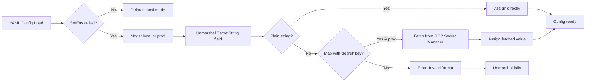

# GSY (Go Secret YAML)

[](https://goreportcard.com/report/github.com/dvormagic/gsy)
[](https://pkg.go.dev/github.com/dvormagic/gsy)
[](https://opensource.org/licenses/MIT)

GSY is a lightweight Go library for secure secret management in YAML configuration files. It provides a `SecretString` type that implements YAML unmarshaling, allowing you to use the same config files across local development (plain strings) and production (Google Cloud Secret Manager references) without code changes.

The library checks a global environment mode (`local` or `prod`) to decide how to resolve secrets during unmarshaling. This makes it ideal for Go applications using YAML configs (e.g., with `gopkg.in/yaml.v3`).

## Why Use GSY?

- **Seamless Environment Switching**: Use identical YAML files in dev and prod. Set `SetEnv("local")` for plain strings, `SetEnv("prod")` for GCP fetches – no config branching or rebuilds.
- **Enhanced Security**: Secrets are never hardcoded in code or exposed in env vars. Production secrets stay securely in GCP Secret Manager, accessed on-demand.
- **Simplicity & Integration**: Embed `SecretString` directly in your config structs. Works out-of-the-box with standard YAML unmarshaling; minimal boilerplate.
- **Lightweight & Fast**: Minimal dependencies (only `yaml.v3` and GCP client). No runtime overhead in local mode.
- **Flexible**: Easy to extend for other secret providers (e.g., AWS SSM) by forking the unmarshaler logic.

GSY solves the common pain of managing secrets in microservices or CLI tools where configs are YAML-based, ensuring compliance with security best practices like least privilege access.

## Installation

Add GSY to your `go.mod`:

```bash
go get github.com/dvormagic/gsy/secretstring
```

For production use with GCP, ensure your environment has Google Cloud authentication set up (e.g., via Application Default Credentials or service account keys).

## Quick Start

1. Import the library and embed `SecretString` in your config struct.
2. Set the environment mode.
3. Unmarshal your YAML as usual.

### Example Code

```go
package main

import (
	"fmt"
	"log"

	"gopkg.in/yaml.v3"

	"github.com/dvormagic/gsy/secretstring"
)

type Config struct {
	APIKey    secretstring.SecretString `yaml:"api_key"`
	Database  secretstring.SecretString `yaml:"database_url"`
	OtherKey  string                    `yaml:"other_key"` // Regular string for non-secrets
}

func main() {
	// Set mode: "local" for dev (plain strings), "prod" for GCP fetches
	secretstring.SetEnv("local") // Change to "prod" for production

	// Example YAML for local dev
	yamlData := []byte(`
api_key: "sk-123-local-api-key"  # Plain string (local mode)
database_url: {secret: "projects/my-project/secrets/db-url/versions/latest"}  # GCP ref (ignored in local, fetched in prod)
other_key: "regular-value"
`)

	var cfg Config
	if err := yaml.Unmarshal(yamlData, &cfg); err != nil {
		log.Fatal(err)
	}

	fmt.Printf("API Key: %s\n", cfg.APIKey)      // Outputs: sk-123-local-api-key
	fmt.Printf("DB URL: %s\n", cfg.Database)    // Outputs: projects/my-project/secrets/db-url/versions/latest (local mode)
	fmt.Printf("Other: %s\n", cfg.OtherKey)     // Outputs: regular-value
}
```

In **prod mode**, the `database_url` would fetch the actual secret value from GCP instead of using the reference string.

### YAML Formats Supported

- **Plain String (Local/Prod fallback)**: `api_key: "my-secret-value"`
- **GCP Secret Reference (Prod only)**:
  ```yaml
  api_key:
    secret: "projects/my-project/secrets/my-api-key/versions/latest"
  ```
  - `secretName` must be the full GCP resource name.
  - In local mode, it falls back to using the reference as a plain string (useful for mocking).

## Usage Flow



## Advanced Usage

### GCP Setup

- Ensure your Go app runs in an environment with GCP credentials (e.g., GCE, GKE, or `GOOGLE_APPLICATION_CREDENTIALS` env var).
- Secret names follow GCP format: `projects/{project}/secrets/{secret}/versions/latest`.
- Handle errors from `UnmarshalYAML` or `FetchSecretFromGCP` for IAM/permission issues.

### Error Handling

```go
if err := yaml.Unmarshal(data, &cfg); err != nil {
    // Could be GCP access error in prod
    log.Printf("Config error: %v", err)
    // Fallback: Use env vars or defaults
}
```

### Custom Modes

The library uses a simple string check. Extend by modifying `secretStringEnv` logic or subclassing `SecretString`.

### Direct Secret Fetching

Use `FetchSecretFromGCP` independently:

```go
val, err := secretstring.FetchSecretFromGCP("projects/my-project/secrets/my-secret/versions/latest")
if err != nil {
    // Handle error
}
```

## Examples

See the [example/main.go](example/main.go) for a runnable demo with both modes and error handling.

## Testing

Run unit tests (add them via `go test`):

```bash
go test ./secretstring
```

Integration tests with GCP require a test project and secrets.

## Contributing

1. Fork the repo.
2. Create a feature branch (`git checkout -b feature/amazing-feature`).
3. Commit changes (`git commit -m 'Add amazing feature'`).
4. Push (`git push origin feature/amazing-feature`).
5. Open a Pull Request.

Please add tests for new features and ensure code passes `go fmt` and `go vet`.

## License

This project is licensed under the MIT License - see the [LICENSE](LICENSE) file for details.

## Acknowledgments

Inspired by secure config patterns in Go microservices. Thanks to Google Cloud for Secret Manager.

---

_Built with ❤️ for secure Go configs._
